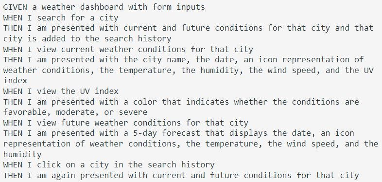
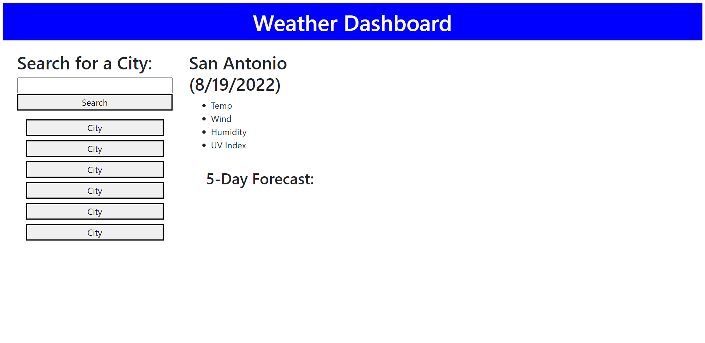

# weather-dashboard-project

## Plan Of Attack

- Build html elements. 
- Style elements using CSS. 
- Make sure to use open weather api for forecast and UV index. 
- Make fetch requests to receive data back. Apply that data to dynamically create elements on the page. 
- Color code UV index

## Screenshot of App

### Deployed GitHub Pages Link 
https://markanthony9014.github.io/weather-dashboard-project/